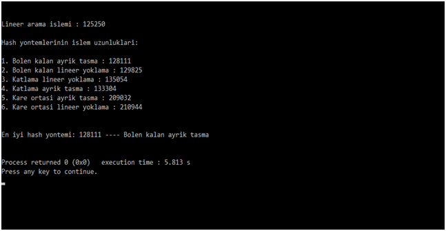

### Dosya Organizasyonunda Hashing
Uygulamada içerisinde öğrenci numarası ve öğrenci adı bilgileri bulunan, program her çalıştığında rastgele olarak farklı
bilgiler oluşacak şekilde beş yüz elemanlı bir dosya yapısı oluşturarak daha sonra bu dosya üzerinde hashing uygulamalarını gerçeklenmiştir ve
bu işlemleri yaparken işlem sayılarını sayarak hangi hashing yönteminin dosya işlemlerinde daha iyi sonuç verdiğini görmek. Hashing uygulamaları
için, bölen kalan, kare ortası ve katlama metodları, ayrık çakışma ve lineer yoklama yöntemleri ile iki farklı yolla gerçekleştirilmiştir.
Projeyi gerçekleştirmek için ilk önce içerisinde beş yüz kayıtın tutulduğu ve program her çalıştığında tutulan bu kayıtların rastgele olarak yenilendiği
bir bağıl dosya oluşturulmuştur. Daha sonra üç farklı hashing yöntemi iki farklı yolla toplamda altı uygulama ile bu dosyadan altı farklı bağıl dosya
daha oluşturulmuştur. Proje oluşturulurken kullanılan bu yöntemler ise şu şekildedir: “ Bölen kalan lineer yoklama ”, ” Bölen kalan ayrık taşma ”, ” Kare
ortası lineer yoklama ”, “ Kare ortası ayrık taşma ”, “ Katlama lineer yoklama “ ve son olarak da “ Katlama ayrık taşma “. Yukarıda adı geçen bu yöntemler
ile ana dosyamızdan altı tane daha bağıl dosya oluşturduktan sonra hangi hashing yönteminin dosya işlemlerinde daha iyi sonuç verdiğini görmek için yöntemleri
birbirileri ile karşılaştırdık.  Karşılaştırma işlemini yaparken ilk önce altı farklı dosya oluştururken ki işlem adımlarını saydırdık.
Daha sonra ise ana dosyada ki her bir öğrenci numarasının bulunması için oluşturulan arama fonksiyonlarında ki işlem adımlarını saydırdık.
Tüm bu saydırma işlemleri bittikten sonra her hashing uygulaması için toplam sonuçları bularak hangi hashing uygulamasının daha iyi sonuç verdiğini gösterdik.

